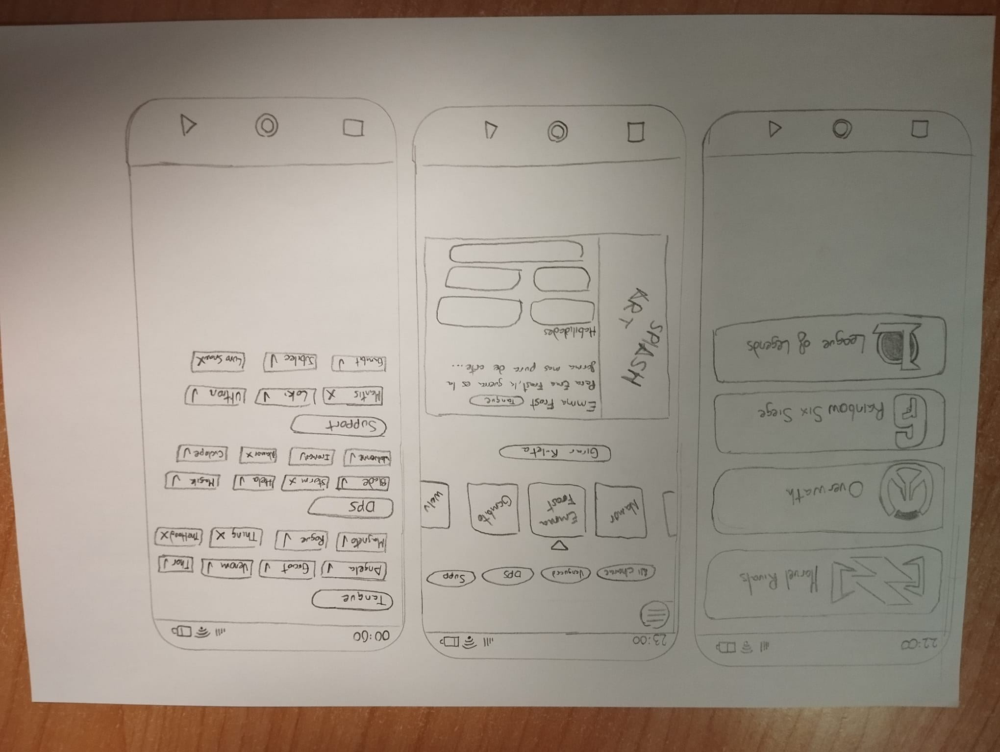
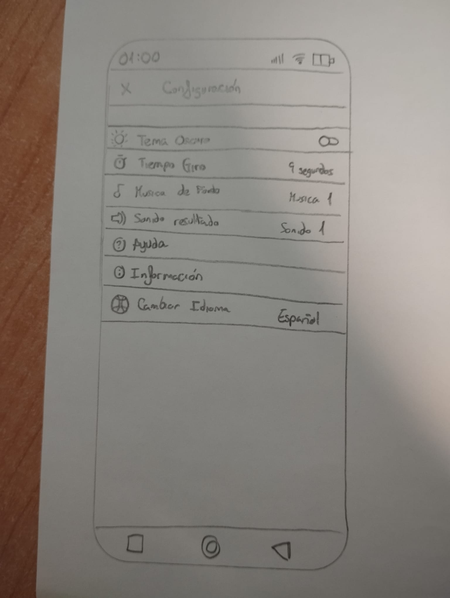

# Plantilla: propuesta del Proyecto A

---

## 0 · Datos

| | |
|---|---|
| **Nombre de la app** | PickForMe |
| **Autor/a** | Erik Dafonte |
| **Fecha** | 23/09/2026 |

---

## 1 · La idea en una frase

> Qué hace tu app y para quién, en una sola frase.
>
> Fórmula: «Una app que permite a [quién] hacer [qué] para [para qué].»

    Es una aplicacion para jugadores de HeroShooter(de momento) puedan girar una ruleta para decidir que personaje jugar en su siguiente partida y que ademas te propone algunos retos

---

## 2 · El problema

> ¿Qué problema resuelve? ¿Cómo se resuelve hoy sin tu app?

    Resuelve el problema de que a veces no quieres jugar tu main y simplemente no hay nada en especifico que te apetezca jugar y a dia de hoy se resuelve pues cogiendo una ruleta normal de google y metiendo ahi los personajes a mano o buscando si hay alguna pagina que lo haga para un juego en especifico

---

## 3 · Personas usuarias

> ¿Quién la va a usar? Describe a una persona concreta: edad, soltura con la
> tecnología, cuándo y dónde abre la app, cuánto tiempo le dedica y qué pasa
> si le falla.

    Gente entre 16 y 20 años que juega con frecuencia videojuegos y en especifio HeroShooters que no tiene ganas de jugar su main y no hay otro personaje que le apetezca y antes de entrar a cola de partida abre la aplicacion le da a girar y si falla pues no hay mucho problema ya que simplemente perderias el resultado del personaje que salio.

---

## 4 · Funcionalidades

### Imprescindibles (sin esto la app no tiene sentido)

| # | Funcionalidad |
|---|---------------|
| F1 | Elegir juego ya sea Marvel Rivals, Overwatch, Rainbow Six Siege, LoL... y que te de un personaje aleatorio del roster |
| F2 | Filtrar por rol (tanque/dps/soporte en el caso de los HeroShooter, Entry,Apoyo,Ancla,Roamer etc... en el caso de R6 y Top,Jungla,Medio,Adc o soporte en el caso de LoL ) |
| F3 | Poder excluir personajes ya sea porque no te gustan o no los sabes usar para que no salgan a la hora de girar la ruleta |

### Opcionales (si sobra tiempo)

| # | Funcionalidad |
|---|---------------|
| O1 | Generar retos aleatorios |
| O2 | Poder Randomizar equipos completos para jugar con tus amigos |

---

## 5 · Pantallas

| Pantalla | Para qué sirve | Se llega desde |
|----------|----------------|----------------|
| Selector de juego | Elegir con qué juego quieres jugar a la ruleta (Overwatch / LoL / R6) | (arranque) |
| Ruleta | Pulsar "Girar La Ruleta" (o agitar el móvil) y ver el personaje asignado, con su rol y foto/splash | Selector de juego |
| Gestión de roster | Marcar personajes como excluidos o favoritos para ese juego, para que no salgan en la tirada | Ajustes |
| Ajustes | Preferencias generales (juego por defecto, activar/desactivar gesto de agitar, etc.) | Ruleta / Resultado |

---

## 6 · Bocetos

> Dibuja las pantallas principales. A mano y fotografiado es válido.
> Pega aquí las imágenes o indica el nombre de los archivos adjuntos.

   

---

## 7 · Qué datos guarda la app

| Tipo de dato | Campos | Ejemplo |
|--------------|--------|---------|
| Juego | nombre | "Marvel Rivals" |
| Personaje | juego,nombre,rol, descripcion dentro del juego,excluido si o no | Marvel Rivals, Emma Frost, Tanque,Para Emma Frost, la guerra es la forma más pura de arte..., no |
| Reto | nombre, descripcion | Lee Sin lore accurate, juega Lee Sin bajando en los ajustes de Accesibilidad el "Nivel de color" , el "Gamma de color" y el "Brillo de color" a 0 y subiendo el "Contraste de color" a 100|

---

## 8 · Encaje con los requisitos del módulo

> Apartado obligatorio: ninguna casilla puede quedar vacía.

| Requisito | Dónde encaja en tu app | Tema |
|-----------|------------------------|------|
| **Persistencia de datos** — la información sobrevive al cerrar la app | guardar qué personajes tiene el usuario excluidos/favoritos entre sesiones | 4 |
| **Servicio web** — la app consulta datos por internet | La app consulta distintas fuente para segun que juego: Data Dragon para el LoL y que es oficial de Riot, OverFast que no es oficial de Blizzard pero es estable, Marvel RivalsAPI.com que tiene una Key gratuita y de Rainbow Six no hay nada oficial ni decente asi que este va a estar en local si o si | 5 |
| **Sensor o localización** | poder agitar el movil para hacer que la ruleta gire | 6 |
| **Contenido multimedia** — foto, audio, vídeo o animación | splash art del personaje que te salga y animacion de girar la ruleta | 7 |

---

## 9 · Riesgos

| Lo que me preocupa | Plan B |
|--------------------|--------|
| Que las API no funcionen bien | lo guardaria todo en local |

---

## Antes de entregar

- [ ] La idea cabe en una frase.
- [ ] El público es una persona concreta, no «todo el mundo».
- [ ] Hay **3 o 4** funcionalidades imprescindibles, no diez.
- [ ] Cada funcionalidad imprescindible tiene su pantalla.
- [ ] Hay bocetos de las pantallas principales.
- [ ] **Las cuatro casillas del apartado 8 están rellenas.**
- [ ] Está identificado al menos un riesgo con su plan B.
